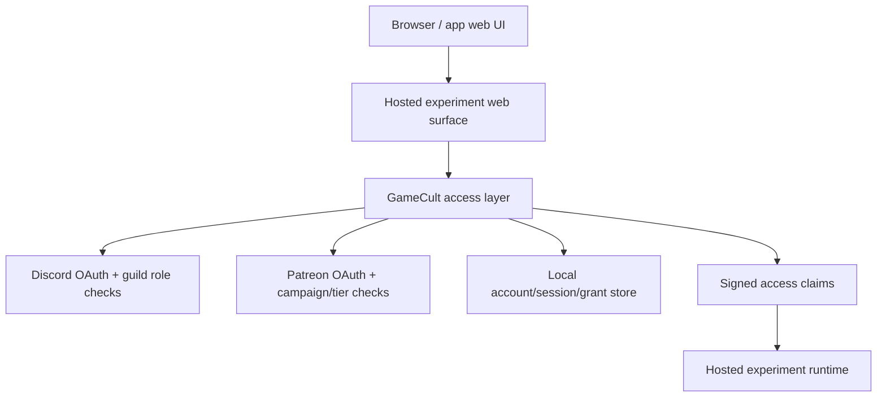

# GameCult Hosted Access Architecture

## What this file is

This file is the shared architecture note for GameCult-hosted experiments that
need the same basic promise:

- let people sign in with Discord and/or Patreon
- decide access from GameCult/community entitlements
- keep app runtimes tied to local sessions and local accounts, not provider ids

It is not a map of landed auth code yet.

## Problem

If every experiment rebuilds:

- provider OAuth
- identity linking
- entitlement refresh
- session cookies
- queue/job ownership
- "Discord role OR Patreon tier" logic

then we get five near-identical auth pits and deserve what happens next.

The reusable move is to build one GameCult hosted-access layer and let each app
bind its own policy and runtime seams onto it.

## Design goals

- one reusable local account/session model across hosted experiments
- provider login and linking owned by one shared access layer
- per-app capability policies instead of hard-coded one-off gate checks
- host runtimes consume signed local session claims, not raw provider tokens
- keep app-domain data separate unless there is a deliberate reason to share it
- start as an embedded shared package before pretending we need a central auth
  service

## Non-goals

- becoming a general public identity provider
- building multi-tenant SaaS auth machinery
- inventing global billing analytics because we got bored
- forcing cross-app single sign-on on day one before a second app exists

## Core concepts

- `Account`
  one GameCult-local person record independent of external providers
- `LinkedIdentity`
  one external provider identity attached to exactly one local account
- `EntitlementSnapshot`
  cached result from a provider or grant source saying whether some claim is
  currently true
- `CapabilityGrant`
  a reusable local grant such as `global_member`, `app_access`, or
  `admin_access`, scoped either globally or to one app
- `AppAccessProfile`
  the per-app binding that names capabilities, allowed provider sources, and
  policy rules
- `Session`
  signed local app/browser session; the browser gets this, not provider tokens
- `AuditEvent`
  durable record for login, link, unlink, refresh, denial, and admin overrides

## System shape



The important split:

- the access layer owns provider OAuth, identity linking, entitlement refresh,
  and signed local sessions
- the host experiment owns its workload, queue, editor, render path, or other
  product-specific machinery

Do not smear provider logic directly through every host runtime.

## Backbone reuse is not data merging

Using the same auth backbone does **not** mean all hosted experiments should
pour their user data into one communal bucket.

The reusable thing is:

- provider OAuth plumbing
- signed local session mechanics
- linked-identity primitives
- entitlement refresh
- capability evaluation

The non-reusable-by-default thing is:

- app-domain user data
- creator data
- audience data
- queue/job payloads
- inventories, scenes, outputs, or other product state

Recommended default:

- shared auth/access **code**
- separate app databases or at least separate app-owned schemas/tables for
  domain data
- if a shared access store exists at all, keep it limited to auth/control-plane
  truth such as identities, grants, entitlement snapshots, sessions, and audit
  events

Do not let "same auth backbone" quietly mutate into "same user-data swamp."

## Reusable data model

Suggested durable core:

- `accounts`
  - `id`
  - `created_at`
  - `last_seen_at`
  - `display_name`
  - `primary_email` nullable
- `linked_identities`
  - `id`
  - `account_id`
  - `provider`
  - `provider_user_id`
  - `username`
  - `access_token_encrypted`
  - `refresh_token_encrypted`
  - `token_expires_at`
  - `profile_json`
  - unique on `(provider, provider_user_id)`
- `entitlement_snapshots`
  - `id`
  - `account_id`
  - `provider`
  - `scope`
  - `evaluated_at`
  - `is_allowed`
  - `reason_code`
  - `reason_detail`
  - `raw_summary_json`
- `capability_grants`
  - `id`
  - `account_id`
  - `scope_type` enum: `global`, `app`
  - `scope_id` nullable app slug
  - `capability`
  - `source` enum: `manual`, `invite`, `migration`, `operator`
  - `status`
  - `expires_at` nullable
  - `note`
- `sessions`
  - `id`
  - `account_id`
  - `app_slug`
  - `created_at`
  - `last_seen_at`
  - `expires_at`
  - `claims_json`
  - `access_revision`
- `audit_events`
  - `id`
  - `account_id` nullable
  - `session_id` nullable
  - `app_slug` nullable
  - `event_type`
  - `event_payload_json`
  - `created_at`

Important invariants:

- one provider identity belongs to one local account only
- provider tokens stay server-side only
- session cookies represent local sessions, not provider trust directly
- app-specific capability checks read local claims, not Discord or Patreon on
  every route

## Provider adapters

Shared provider/gate adapters should be boring and reusable:

- `DiscordRoleEntitlementProvider`
  - login via Discord OAuth
  - entitlement check via guild membership and role ids, ideally through the
    GameCult bot token server-side
- `PatreonMembershipEntitlementProvider`
  - login via Patreon OAuth
  - entitlement check via campaign membership and tier ids
- `ManualGrantProvider`
  - local override for staff, migrations, experiments, or emergency access
- `InviteGrantProvider`
  - reusable invite-issued app or role grants where that pattern makes sense

## Policy model

The reusable core should not hard-code one app's access rules. It should
evaluate capabilities against an app profile.

Suggested app-profile shape:

```text
AppAccessProfile {
  appSlug: string
  displayName: string
  capabilities: string[]
  policyRules: CapabilityRule[]
  publicRoutes: string[]
  explanationStrings: map[string]string
}
```

Example rule style:

```text
app_access   = discord.allowed_role || patreon.allowed_tier || grant.global_member || grant.app_access
queue_submit = app_access
admin_access = grant.operator || grant.admin_access
```

## Auth and linking flow

The generic flow should be the same across hosted experiments:

1. user starts OAuth from the host app UI
2. shared access layer signs OAuth `state`
3. provider callback resolves the provider identity
4. shared layer finds or creates the local account
5. if the user was already signed in locally, the identity may link onto the
   existing account instead of creating a new one
6. shared layer refreshes entitlements and capability claims
7. shared layer issues or updates the local session cookie

The browser should never be the custodian of provider tokens.

## App integration contract

Every hosted experiment should integrate through the same seams:

- define an `app_slug`
- define the app capability profile
- mark which routes are public, authenticated, or capability-gated
- attach `account_id`, `session_id`, and `access_revision` to owned resources
  such as jobs, drafts, uploads, or queue entries
- require resource-owner checks on private read/update/delete paths

If an app has a queue or job system:

- queue entries belong to local account/session ids, not provider ids
- entitlement refresh should block new submissions after access loss
- active-job cancellation policy is app-specific, but the recommended first cut
  is still "let the active job finish, block new work"

## Deployment modes

### Mode 1: Embedded shared package

Recommended first cut.

- one shared `gamecult_access` package/module
- each hosted experiment embeds it
- each app keeps its own runtime and route integration
- sessions may still be app-local
- each app keeps its own domain-data store

Why this is the right first cut:

- reusable without forcing a separate always-on dependency
- small blast radius
- easy to evolve while only one or two apps use it

### Mode 2: Same-host shared access service

Use this when multiple apps on the same server want one shared access store and
session issuer, but full centralization still feels premature.

### Mode 3: Dedicated GameCult access service

Only do this when multiple independently deployed apps genuinely need:

- shared cross-app sessions
- central grant administration
- one callback origin for all providers
- enough auth churn that duplicated embedded deployments become the bigger pain

Do not build this first because it sounds important.

Even in this mode, the dedicated service should own auth/control-plane data, not
absorb every app's audience or product data.

## Configuration split

Suggested generic env surface:

- `GC_ACCESS_ENABLED=1`
- `GC_ACCESS_SESSION_SECRET=...`
- `GC_ACCESS_BASE_URL=https://access.gamecult.org` or host-app local equivalent
- `GC_ACCESS_DISCORD_CLIENT_ID=...`
- `GC_ACCESS_DISCORD_CLIENT_SECRET=...`
- `GC_ACCESS_DISCORD_BOT_TOKEN=...`
- `GC_ACCESS_DISCORD_GUILD_ID=...`
- `GC_ACCESS_PATREON_CLIENT_ID=...`
- `GC_ACCESS_PATREON_CLIENT_SECRET=...`
- `GC_ACCESS_PATREON_CAMPAIGN_ID=...`
- `GC_ACCESS_ENTITLEMENT_CACHE_TTL_SECONDS=900`
- `GC_ACCESS_PROVIDER_FAILURE_GRACE_SECONDS=3600`

Per-app binding should live in code or profile config, not in cloned provider
env namespaces.

## Audit Result

The correct reusable seam is:

- shared provider/session/entitlement/capability machinery
- thin per-app access profiles and runtime bindings

The incorrect reusable seam is:

- cloning one app’s auth blob into every future experiment
- or turning shared auth into shared domain-data soup
