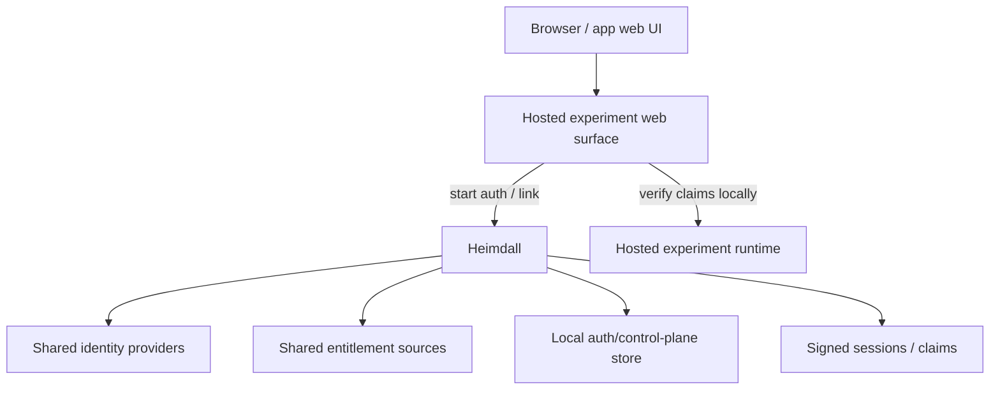

# Heimdall Architecture

## What this file is

This file is the shared architecture note for Heimdall, the planned auth
authority service for GameCult-hosted experiments.

Its basic promise is:

- let people sign in through app-relevant providers such as Discord, Patreon,
  GitHub, Twitch, or YouTube
- decide access from provider entitlements, local grants, and per-app policy
- issue signed local claims that hosted apps can verify without trusting raw
  provider tokens

It is not a map of landed auth code yet.

## Problem

If every experiment rebuilds:

- provider OAuth
- identity linking
- entitlement refresh
- session cookies
- grant handling
- provider-specific gate logic

then we get five near-identical auth pits and deserve what happens next.

The reusable move is to build one Heimdall authority service and let each app
bind its own policy and runtime seams onto it.

## Design goals

- one reusable local account/session model across hosted experiments
- provider login and linking owned by one shared authority
- per-app capability policies instead of hard-coded one-off gate checks
- host runtimes consume signed local claims, not raw provider tokens
- routine route auth stays local to the host app after claim verification
- keep app-domain data separate unless there is a deliberate reason to share it
- fit the current GameCult topology: Heimdall on Yggdrasil behind nginx, with
  hosted apps either on the same host or verifying over normal HTTPS/JWKS

## Non-goals

- becoming a general public identity provider
- building multi-tenant SaaS auth machinery
- inventing global billing analytics because we got bored
- forcing app-domain data into a shared auth store
- requiring every guarded route in every app to call Heimdall synchronously

## Core concepts

- `Account`
  one GameCult-local person record independent of external providers
- `LinkedIdentity`
  one external provider identity attached to exactly one local account
- `EntitlementSnapshot`
  cached result from an entitlement source saying whether some claim is
  currently true
- `CapabilityGrant`
  a reusable local grant such as `global_member`, `app_access`, or
  `admin_access`, scoped either globally or to one app
- `AppAccessProfile`
  the per-app binding that names capabilities, relevant identity providers,
  entitlement sources, and policy rules
- `Session`
  signed local app/browser session; the browser gets this, not provider tokens
- `AccessClaim`
  signed app-facing claim set derived from the account, grants, and app policy
- `AuditEvent`
  durable record for login, link, unlink, refresh, denial, and admin overrides

## Provider taxonomy

Heimdall should classify outside systems by what role they play, not by whether
their brand name appears somewhere in an app.

- `Identity provider`
  proves who the user is and can supply one `LinkedIdentity`
- `Entitlement source`
  answers whether some access-relevant claim is currently true
- `Managed provider credential`
  a user- or account-authorized third-party credential whose OAuth dance, token
  custody, refresh, and revocation Heimdall can own on behalf of an app
- `Local grant source`
  records app or operator-issued overrides inside Heimdall

Default rule:

- if a future app needs user-facing or account-linked OAuth, Heimdall should
  own the ugly parts by default
- the app should only need to describe what the resulting connection means in
  its own world

One provider can play different roles in different apps:

- Repixelizer can treat Discord and Patreon as both identity and entitlement
  sources
- Bifrost can treat GitHub as identity proof while keeping membership approval,
  roles, and governance state app-local
- StreamPixels can reuse shared viewer identity patterns and even shared
  OAuth/token custody for creator-side Twitch/YouTube connections while keeping
  creator bindings, subscriptions, diagnostics, and runtime plumbing
  StreamPixels-owned

## System shape



The important split:

- Heimdall owns provider OAuth, identity linking, entitlement refresh, signed
  sessions, claims, grants, audit surfaces, and managed provider credential
  custody
- the host experiment owns its workload, queue, editor, render path, viewer
  profile model, creator model, or other product-specific machinery
- the host experiment also owns which local entity a connection attaches to,
  what permissions it implies, and what runtime behavior consumes it

Do not smear provider logic directly through every host runtime.

## Backbone reuse is not data merging

Using the same auth backbone does **not** mean all hosted experiments should
pour their user data into one communal bucket.

The reusable thing is:

- provider OAuth plumbing
- signed session and claim mechanics
- linked-identity primitives
- entitlement refresh
- capability evaluation
- local grant and audit surfaces

The non-reusable-by-default thing is:

- app-domain user data
- creator data
- audience data
- queue/job payloads
- inventories, scenes, outputs, or other product state

Recommended default:

- shared auth/access **authority**
- separate app databases or at least separate app-owned schemas/tables for
  domain data
- if a shared Heimdall store exists at all, keep it limited to auth/control
  plane truth such as identities, grants, entitlement snapshots, sessions,
  claims metadata, and audit events

Do not let "same auth backbone" quietly mutate into "same user-data swamp."

## Reusable data model

Suggested durable core:

- `accounts`
  - `id`
  - `created_at`
  - `last_seen_at`
  - `display_name`
  - `primary_email` nullable
- `linked_identities`
  - `id`
  - `account_id`
  - `provider`
  - `provider_user_id`
  - `username`
  - `access_token_encrypted`
  - `refresh_token_encrypted`
  - `token_expires_at`
  - `profile_json`
  - unique on `(provider, provider_user_id)`
- `entitlement_snapshots`
  - `id`
  - `account_id`
  - `provider`
  - `scope`
  - `evaluated_at`
  - `is_allowed`
  - `reason_code`
  - `reason_detail`
  - `raw_summary_json`
- `capability_grants`
  - `id`
  - `account_id`
  - `scope_type` enum: `global`, `app`
  - `scope_id` nullable app slug
  - `capability`
  - `source` enum: `manual`, `invite`, `migration`, `operator`
  - `status`
  - `expires_at` nullable
  - `note`
- `sessions`
  - `id`
  - `account_id`
  - `app_slug`
  - `created_at`
  - `last_seen_at`
  - `expires_at`
  - `claims_json`
  - `access_revision`
- `audit_events`
  - `id`
  - `account_id` nullable
  - `session_id` nullable
  - `app_slug` nullable
  - `event_type`
  - `event_payload_json`
  - `created_at`

Important invariants:

- one provider identity belongs to one local account only
- provider tokens stay server-side only
- session cookies represent local sessions, not provider trust directly
- app-specific capability checks read signed local claims, not upstream
  providers on every route

## Provider adapters

Shared adapters should be boring and reusable:

- `DiscordIdentityProvider`
  - login via Discord OAuth
- `PatreonIdentityProvider`
  - login via Patreon OAuth
- `GitHubIdentityProvider`
  - login via GitHub OAuth for apps that use GitHub identity as the local
    person-key
- `TwitchIdentityProvider`
  - optional shared login identity when an app wants Twitch-backed sign-in
- `YouTubeIdentityProvider`
  - optional shared login identity when an app wants YouTube-backed sign-in
- `DiscordRoleEntitlementProvider`
  - entitlement check via guild membership and role ids, ideally through the
    GameCult bot token server-side
- `PatreonMembershipEntitlementProvider`
  - entitlement check via campaign membership and tier ids
- `ManualGrantProvider`
  - local override for staff, migrations, experiments, or emergency access
- `InviteGrantProvider`
  - reusable invite-issued app or role grants where that pattern makes sense

Shared connection handling can also cover app integrations when the credential
is user- or account-authorized and worth centralizing:

- Heimdall can own OAuth start/callback, token exchange, encrypted storage,
  refresh, and revocation
- the app still owns binding the connection to a local entity such as
  `creator_id`, `workspace_id`, `project_id`, or `channel_id`
- the app still owns sync jobs, subscriptions, diagnostics, feature toggles,
  and the domain-specific consequences of that connection

Important rule:

- a provider being used anywhere in an app does not automatically make all uses
  of that provider Heimdall-owned
- provider OAuth and token custody should default to Heimdall when the
  connection is tied to a user or account rather than a purely app-local secret
- app-specific binding semantics and runtime behavior still stay app-owned

## Policy model

The shared authority should not hard-code one app's access rules. It should
evaluate capabilities against an app profile.

Suggested app-profile shape:

```text
AppAccessProfile {
  appSlug: string
  displayName: string
  capabilities: string[]
  policyRules: CapabilityRule[]
  publicRoutes: string[]
  explanationStrings: map[string]string
}
```

Example rule style:

```text
app_access   = discord.allowed_role || patreon.allowed_tier || grant.global_member || grant.app_access
queue_submit = app_access
admin_access = grant.operator || grant.admin_access
```

The important part is not the provider names in the example. It is that app
profiles choose which identity facts, entitlement snapshots, and local grants
feed each capability.

## Request path discipline

This is where shared authority stays useful instead of becoming a nuisance.

Heimdall should be in the loop for:

- OAuth start and callback flows
- explicit identity linking and unlinking
- session issuance and refresh
- entitlement refresh
- grant administration
- occasional explicit introspection or revocation checks

Host apps should stay in the loop for:

- routine route authorization after claim verification
- resource ownership checks
- domain-specific permission decisions that depend on app-local data

Normal guarded routes should **not** need to round-trip to Heimdall every time.

## Auth and linking flow

The generic flow should be the same across hosted experiments:

1. user starts OAuth from the host app UI
2. host app redirects to Heimdall or calls Heimdall to begin the flow
3. Heimdall signs OAuth `state`
4. provider callback resolves the provider identity through Heimdall
5. Heimdall finds or creates the local account
6. if the user was already signed in locally, the identity may link onto the
   existing account instead of creating a new one
7. Heimdall refreshes entitlements and capability claims
8. Heimdall issues or updates the local session / claim artifacts consumed by
   the host app

The browser should never be the custodian of provider tokens.

## App integration contract

Every hosted experiment should integrate through the same seams:

- define an `app_slug`
- define the app capability profile
- verify Heimdall-issued claims locally
- mark which routes are public, authenticated, or capability-gated
- attach `account_id`, `session_id`, and `access_revision` to owned resources
  such as jobs, drafts, uploads, or queue entries
- if the app uses Heimdall-managed provider connections, bind those connections
  onto app-local entities and keep the downstream runtime behavior local
- require resource-owner checks on private read/update/delete paths

If an app has a queue or job system:

- queue entries belong to local account/session ids, not provider ids
- entitlement refresh should block new submissions after access loss
- active-job cancellation policy is app-specific, but the recommended first cut
  is still "let the active job finish, block new work"

## Deployment topology

Current intended first deployment shape:

- Heimdall runs on `yggdrasil.gamecult.org`
- Heimdall binds a localhost port behind nginx
- public auth hostname is expected to become `heimdall.gamecult.org`
- same-host app stacks such as StreamPixels and Repixelizer call Heimdall over
  localhost or normal private routing when they need auth-authority work done
- app backends verify signed claims locally for routine guarded requests

This matches the host pattern already used by other GameCult app workloads.

## Deployment modes

### Mode 1: Same-host shared access service

Recommended first cut.

- one Heimdall service on Yggdrasil
- each hosted experiment keeps its own runtime and route integration
- each app keeps its own domain-data store
- apps verify signed claims locally after issuance

Why this is the right first cut:

- fits the current host topology
- avoids cross-runtime shared-library nonsense
- keeps OAuth and provider sludge in one place
- keeps routine guarded requests local inside the app

### Mode 2: Multi-host shared access service

Use this when multiple app stacks across hosts still want one shared auth
authority, but the same claim-verification discipline continues.

### Mode 3: Wider cross-app session platform

Only do this when independently deployed apps genuinely need:

- shared cross-app sessions
- central grant administration
- one callback origin for all providers
- enough auth churn that Heimdall is clearly a long-lived platform surface

Do not build this first because it sounds important.

Even in this mode, Heimdall should own auth/control-plane data, not absorb
every app's audience or product data.

## Configuration split

Suggested generic env surface:

- `GC_ACCESS_ENABLED=1`
- `GC_ACCESS_BASE_URL=https://heimdall.gamecult.org`
- `GC_ACCESS_INTERNAL_URL=http://127.0.0.1:4100`
- `GC_ACCESS_SESSION_SECRET=...`
- `GC_ACCESS_PROVIDER_DISCORD_CLIENT_ID=...`
- `GC_ACCESS_PROVIDER_DISCORD_CLIENT_SECRET=...`
- `GC_ACCESS_PROVIDER_DISCORD_BOT_TOKEN=...`
- `GC_ACCESS_PROVIDER_DISCORD_GUILD_ID=...`
- `GC_ACCESS_PROVIDER_PATREON_CLIENT_ID=...`
- `GC_ACCESS_PROVIDER_PATREON_CLIENT_SECRET=...`
- `GC_ACCESS_PROVIDER_PATREON_CAMPAIGN_ID=...`
- `GC_ACCESS_PROVIDER_GITHUB_CLIENT_ID=...`
- `GC_ACCESS_PROVIDER_GITHUB_CLIENT_SECRET=...`
- `GC_ACCESS_PROVIDER_TWITCH_CLIENT_ID=...`
- `GC_ACCESS_PROVIDER_TWITCH_CLIENT_SECRET=...`
- `GC_ACCESS_PROVIDER_YOUTUBE_CLIENT_ID=...`
- `GC_ACCESS_PROVIDER_YOUTUBE_CLIENT_SECRET=...`
- `GC_ACCESS_ENTITLEMENT_CACHE_TTL_SECONDS=900`
- `GC_ACCESS_PROVIDER_FAILURE_GRACE_SECONDS=3600`

Only configure the providers Heimdall actually owns for a given deployment.

Per-app binding should live in code or profile config, not in cloned provider
env namespaces. App-local binding and runtime config such as creator
associations, webhook subscriptions, sync toggles, or workspace/project
attachment rules should stay under the app's own config/state even when the
underlying OAuth credential is Heimdall-managed.

## Audit Result

The correct reusable seam is:

- one shared identity authority service
- local verification of signed claims by each host app
- thin per-app access profiles and runtime bindings

The incorrect reusable seam is:

- cloning one app's auth blob into every future experiment
- or turning shared auth into shared domain-data soup
- or forcing every guarded app route to make a Heimdall network hop
